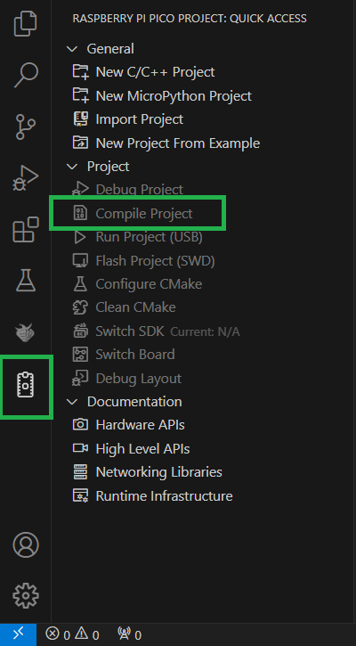

# Conversores A/D  

## Descrição do Projeto  

Este projeto tem como objetivo consolidar o uso de conversores analógico-digitais (ADC) no RP2040 e explorar as funcionalidades da placa BitDogLab. A atividade inclui a utilização do PWM para controlar LEDs RGB com base em valores do joystick, a representação da posição do joystick no display SSD1306, e a aplicação do protocolo de comunicação I2C. Além disso, envolve o uso de interrupções para funcionalidades de botões e debouncing via software.  

## Pré-requisitos  

Antes de executar o projeto, certifique-se de ter os seguintes softwares e ferramentas instalados:  

- [Visual Studio Code (VS Code)](https://code.visualstudio.com/download)  
- [Extensão Raspberry Pi Pico para VS Code](https://marketplace.visualstudio.com/items?itemName=raspberry-pi.raspberry-pi-pico)  
- [Extensão Wokwi Simulator para VS Code](https://marketplace.visualstudio.com/items?itemName=Wokwi.wokwi-vscode)  
- [Git](https://git-scm.com/downloads)  
- [SDK para Raspberry Pi Pico (Pico SDK)](#instalação-e-configuração-do-ambiente)  

Além disso, será necessário possuir uma conta no [site oficial do Wokwi](https://wokwi.com/).  

## Estrutura do Repositório  

```
├── .vscode/                		    # Configurações específicas do projeto para o VS Code
├── img/                    		    # Imagens utilizadas no README para detalhar o projeto
├── lib/                    		    # Cabeçalhos das fontes (letras e números) e controle do display
├── src/                    		    # Código para configuração e controle do display
├── .gitignore              		    # Arquivos ignorados pelo Git
├── CMakeLists.txt          		    # Configuração do CMake para o projeto
├── README.md               		    # Instruções e detalhes do projeto
├── adc.c                               # Código-fonte principal do projeto
├── diagram.json            		    # Arquivo de configuração para o simulador Wokwi
├── pico_sdk_import.cmake   		    # Configuração para importar o Pico SDK
└── wokwi.toml              		    # Arquivo de configuração do Wokwi
```
`OBS.:` o subdiretório `build/` será adicionado ao diretório principal após a configuração automática do CMake.  

## Instalação e Configuração do Ambiente
1. Clone este repositório para seu ambiente local:  
   ```
   git clone https://github.com/SauloAntunes/Tarefa-ADC.git  
   ```

2. Com o VS Code aberto, configure o ambiente de desenvolvimento do Pico SDK, seguindo as instruções:  
    - O Pico SDK pode ser configurado de forma automática durante a configuração do projeto através da extensão Raspberry Pi Pico no VS Code.  
      
    - Passo a passo:  
    `1º:` acesse a extensão Raspberry Pi Pico;  
     `2º:` selecione a opção `Import Project`;  
    `3º:` adicione o caminho do projeto no seu dispositivo, selecione a versão 2.1.0 do Pico SDK (é importante selecionar essa versão para evitar possíveis incompatibilidades) , e por fim clique em `Import`.  
    `OBS.:` após isso, a própria ferramenta realizará a configuração do Pico SDK. Durante o processo de configuração, notificações serão exibidas no canto inferior direito da tela, indicando cada etapa.  

3. Compile o projeto:  
  
  - Passo a passo:  
    `1º:` com o projeto aberto no VS Code, acesse a extensão Raspberry Pi Pico;  
    `2º:` clique na opção `Compile Project` e aguarde o processo de compilação.   

4. Com o VS Code aberto, configure o ambiente Wokwi, seguindo as instruções:
    - A configuração do Wokwi para VS Code pode ser realizada seguindo as orientações disponíveis na [documentação oficial](https://docs-wokwi-com.translate.goog/vscode/getting-started?_x_tr_sl=en&_x_tr_tl=pt&_x_tr_hl=pt&_x_tr_pto=tc&_x_tr_hist=true).

5. Inicie a simulação do projeto:  
    - Para iniciar a simulação do projeto clique no arquivo `diagram.json`, logo em seguida será aberta uma tela com a simulação do projeto, contendo os componentes como a placa Raspberry Pi Pico W, o display, entre outros. Após a abertura da simulação do projeto, clique no botão verde de começar.  

## Estrutura de Controle  

- Controle da intensidade luminosa dos LEDs RGB: 
    - O LED azul terá seu brilho ajustado conforme o valor do eixo Y. Quando o joystick estiver solto (posição central), o LED permanecerá apagado. À medida que o joystick for movido para cima (valores menores) ou para baixo (valores maiores), o LED aumentará seu brilho gradualmente, atingindo a intensidade máxima nos extremos (0 e 4095).  
    - O LED vermelho seguirá o mesmo princípio, mas de acordo com o eixo X. Quando o joystick estiver solto (posição central), o LED estará apagado. Movendo o joystick para a esquerda (valores menores) ou para a direita (valores maiores), o LED aumentará de brilho, sendo mais intenso nos extremos (0 e 4095).  
- O display SSD1306 exibirá um quadrado de 8x8 pixels, inicialmente centralizado, que se moverá proporcionalmente aos valores capturados pelo joystick.  
- Controle via botões:
    - Botão do joystick:
        - Alternar o estado do LED verde a cada acionamento.
        - Modifica a borda do display para indicar quando for pressionado, alternando a borda a cada novo acionamento. 
    - Botão A:
        - Ativa ou desativa os LED PWM a cada acionamento.  
## Vídeo de Apresentação da Solução

Para mais detalhes sobre a implementação e os resultados, assista ao vídeo da solução: [Link para o vídeo](https://drive.google.com/file/d/1YzQ5KDNzBgjZUSaCRn0EaR2aiDco_feT/view?usp=sharing).  